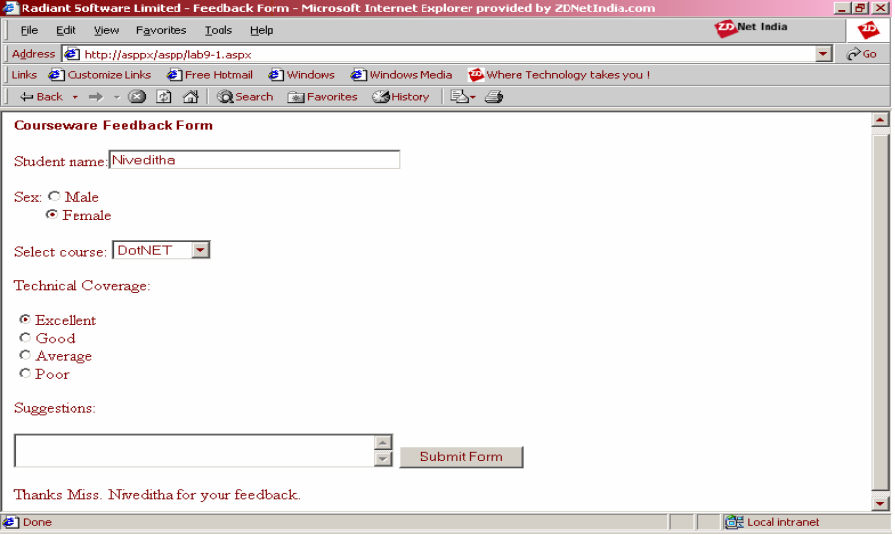

# Exercise 01
Write a program to display the following feedback form.
The different options for the list box must be ASP-XML, DotNET, JavaPro and Unix,C,C++. When the
Submit Form button is clicked after entering the data, a message as seen in the last line of the above
figure must be displayed.
